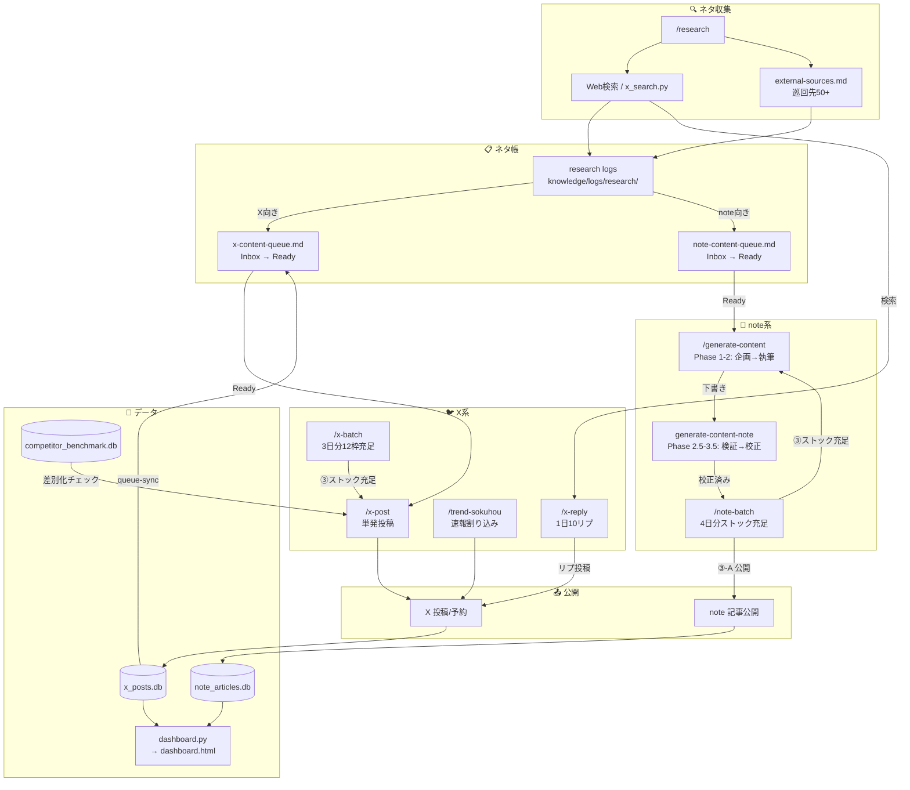
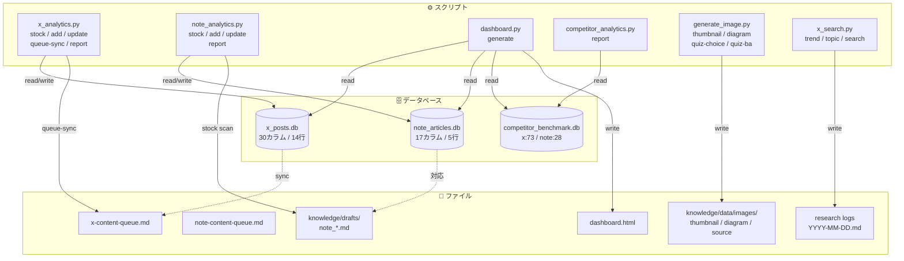
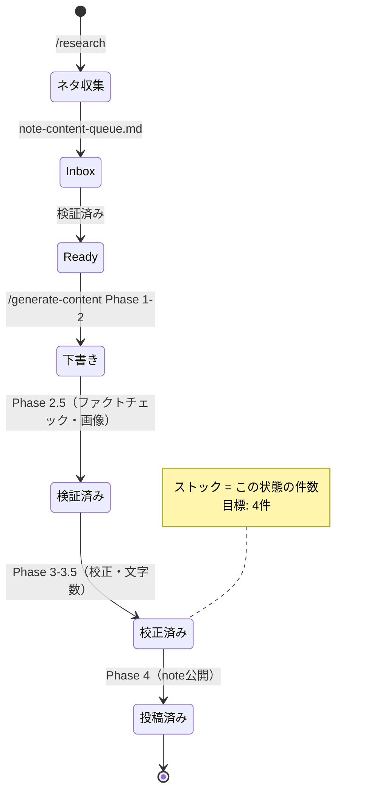
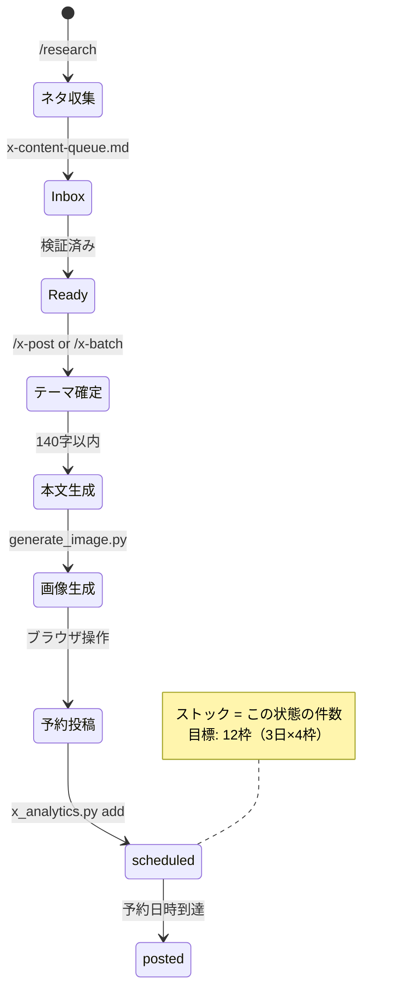

# Pipeline Map

ワークフロー・スクリプト・データの接続を可視化する。

---

## 全体パイプライン

---

## コマンド別フロー

### /x-batch（X日常運用）

```mermaid
graph LR
    subgraph PHASE1["① データ取得"]
        S1["stock --days 3<br/>空き枠把握"]
        S2["予約→投稿<br/>遷移確認"]
        S3["メトリクス収集<br/>imp/eng/likes..."]
        S4["queue-sync<br/>DB→queue.md"]
    end

    subgraph PHASE2["② レポート確認"]
        D1["dashboard generate"]
        D2["改善シグナル読取<br/>ER=0% / 偏り / クロス"]
        D3["report --days 14"]
        D4["空きスロット設計"]
        D5["★ ユーザー確認"]
    end

    subgraph PHASE3["③ ストック充足"]
        P1["テーマ確定<br/>queue → ideas → 生成"]
        P2["本文生成<br/>140字以内"]
        P3["画像生成<br/>generate_image.py"]
        P4["予約投稿<br/>ブラウザ操作"]
        P5["DB登録<br/>x_analytics.py add"]
        P6["★ ユーザー承認"]
    end

    S1 --> S2 --> S3 --> S4
    S4 --> D1 --> D2 --> D3 --> D4 --> D5
    D5 -->|承認| P1 --> P2 --> P3 --> P4 --> P6
    P6 -->|承認| P5
    P5 -->|次の投稿| P1
```

### /note-batch（note日常運用）

```mermaid
graph LR
    subgraph PHASE1["① データ取得"]
        N1["stock<br/>下書きストック確認"]
        N2["メトリクス収集<br/>views/likes/comments"]
        N3["ステータス同期<br/>投稿済み判定"]
    end

    subgraph PHASE2["② レポート確認"]
        ND1["dashboard generate"]
        ND2["report --days 14"]
        ND3["ネタ帳確認<br/>note-content-queue.md"]
        ND4["作成計画"]
        ND5["★ ユーザー確認"]
    end

    subgraph PHASE3["③ ストック充足"]
        direction TB
        subgraph PUB["A. 今日の1記事公開"]
            PA1["校正済み下書き選択"]
            PA2["Phase 4: note公開"]
            PA3["★ ユーザー承認"]
        end
        subgraph DRAFT["B. 下書き作成（4日分まで）"]
            PB1["/research<br/>Web検索→ネタ帳"]
            PB2["/generate-content<br/>Phase 1-2: 企画→執筆"]
            PB3["Phase 2.5-3.5<br/>検証→校正"]
            PB4["ネタ帳更新<br/>Ready → Used"]
        end
    end

    N1 --> N2 --> N3
    N3 --> ND1 --> ND2 --> ND3 --> ND4 --> ND5
    ND5 -->|承認| PA1 --> PA2 --> PA3
    PA3 --> PB1 --> PB2 --> PB3 --> PB4
    PB4 -->|次の記事| PB1
```

---

## データフロー

---

## 記事ライフサイクル（note）

---

## X投稿ライフサイクル

---

## 参照一覧

| カテゴリ | ファイル | 役割 |
|---------|---------|------|
| **ワークフロー** | `.claude/workflows/x-batch.md` | X日常バッチ |
| | `.claude/workflows/note-batch.md` | note日常バッチ |
| | `.claude/workflows/x-post.md` | X単発投稿 |
| | `.claude/workflows/research.md` | ネタ収集 |
| | `.claude/workflows/generate-content.md` | 記事生成（共通） |
| | `.claude/workflows/generate-content-note.md` | note固有（検証→公開） |
| | `.claude/workflows/x-reply.md` | Xアウトリーチリプ |
| | `.claude/workflows/trend-sokuhou.md` | トレンド速報 |
| **スクリプト** | `scripts/x_analytics.py` | X投稿DB管理 |
| | `scripts/note_analytics.py` | note記事DB管理 |
| | `scripts/dashboard.py` | ダッシュボード生成 |
| | `scripts/competitor_analytics.py` | 競合分析 |
| | `scripts/generate_image.py` | 画像生成 |
| | `scripts/x_search.py` | X検索 |
| **データ** | `knowledge/data/x_posts.db` | X投稿メトリクス |
| | `knowledge/data/note_articles.db` | note記事メトリクス |
| | `knowledge/data/competitor_benchmark.db` | 競合データ |
| **キュー** | `knowledge/x-content-queue.md` | Xネタ帳 |
| | `knowledge/note-content-queue.md` | noteネタ帳 |
| **下書き** | `knowledge/drafts/note_*.md` | note記事下書き |
| **戦略** | `knowledge/account-concept.md` | ペルソナ・トーン |
| | `knowledge/content-types.md` | C×P×T定義 |
| | `knowledge/sites/x/posting-strategy.md` | X配置ルール |
| | `knowledge/sites/x/reply-strategy.md` | Xリプ戦略 |
